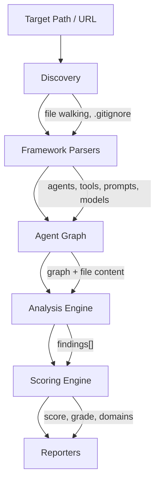
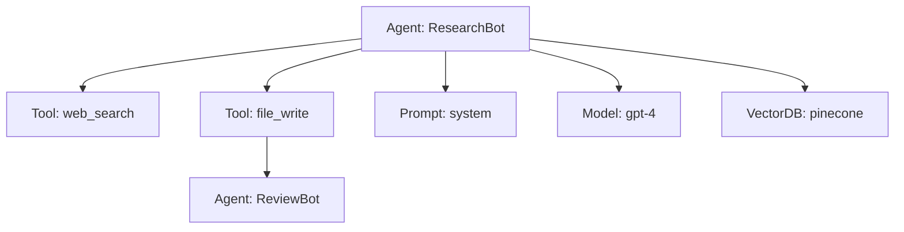
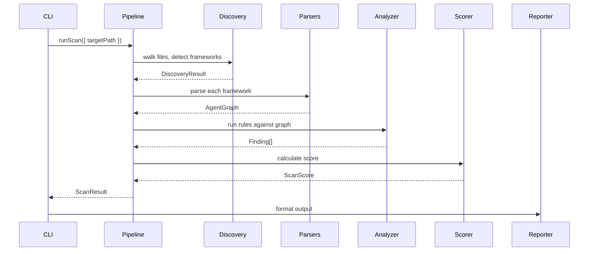

# Architecture

g0 is structured as a multi-stage pipeline that transforms source code into a security assessment. This document explains each stage and how the modules connect.

## Pipeline Overview



## Stage 1: Discovery

**Module:** `src/discovery/`

The discovery engine walks the project directory, respects `.gitignore`, and runs framework detectors to identify which AI frameworks are in use.

**Detectors** (`src/discovery/detectors/`):

| Detector | Identifies |
|----------|-----------|
| `langchain.ts` | LangChain / LangGraph (Python, JS/TS) |
| `crewai.ts` | CrewAI (Python) |
| `openai.ts` | OpenAI Agents SDK (Python, JS/TS) |
| `mcp.ts` | Model Context Protocol servers and configs |
| `vercel-ai.ts` | Vercel AI SDK (JS/TS) |
| `bedrock.ts` | Amazon Bedrock agents (Python, JS/TS) |
| `autogen.ts` | Microsoft AutoGen (Python) |
| `langchain4j.ts` | LangChain4j (Java) |
| `spring-ai.ts` | Spring AI (Java) |
| `golang-ai.ts` | Go AI frameworks (Go) |

Each detector returns a `DetectionResult` indicating whether the framework is present and which files are relevant.

## Stage 2: Framework Parsers

**Module:** `src/analyzers/parsers/`

Parsers extract structured information from source code. Each parser understands a framework's idioms and produces normalized nodes:

- **AgentNode** — An AI agent definition (name, model, tools, prompt)
- **ToolNode** — A tool the agent can invoke (name, description, capabilities)
- **PromptNode** — A prompt template (content, type: system/user/template)
- **ModelNode** — An LLM model reference (provider, model name, parameters)
- **VectorDBNode** — A vector database connection

Parsers use regex-based pattern matching for speed, with optional Tree-sitter AST analysis for deeper extraction when native modules are available.

## Stage 3: Agent Graph

**Module:** `src/types/agent-graph.ts`

The Agent Graph is the core data structure — a directed graph connecting all discovered AI components:



The graph captures:
- Which tools each agent can invoke
- Which prompts configure each agent
- Which models each agent uses
- Agent-to-agent delegation chains
- Data flow paths (user input to tool execution)

## Stage 4: Analysis Engine

**Module:** `src/analyzers/`

The analysis engine runs all rules against the Agent Graph and source code. Rules come from two sources:

### TypeScript Rules (`src/analyzers/rules/`)

12 domain files, each exporting a `Rule[]` array. These handle complex checks requiring AST analysis, multi-file correlation, or custom logic.

### YAML Rules (`src/rules/builtin/`)

675+ declarative rules compiled at startup by `src/rules/yaml-compiler.ts`. Support 11 check types:

| Check Type | What It Does |
|-----------|-------------|
| `code_matches` | Regex match against source code |
| `prompt_contains` | Pattern found in prompt content |
| `prompt_missing` | Required pattern absent from prompt |
| `config_matches` | Pattern in configuration files |
| `agent_property` | Agent node property check (missing/exists/equals) |
| `model_property` | Model node property check |
| `tool_missing_property` | Tool lacks a security property |
| `tool_has_capability` | Tool has a risky capability |
| `project_missing` | Project lacks a security control |
| `taint_flow` | Data flows from source to sink without sanitizer |
| `no_check` | Advisory-only, no static check |

### Advanced Analyzers

Beyond rule-based detection, g0 runs specialized analyzers in the pipeline:

| Analyzer | Module | What It Does |
|----------|--------|-------------|
| **Pipeline Taint** | `src/analyzers/pipeline-taint.ts` | Detects multi-step shell exfil chains (source → obfuscation → sink) in subprocess calls |
| **Cross-Tool Correlation** | `src/analyzers/cross-tool-correlation.ts` | Identifies 7 dangerous capability combinations across agent-bound tools |
| **Cross-File Exfiltration** | `src/analyzers/cross-file-exfil.ts` | Traces sensitive reads → import chain → network writes via moduleGraph |
| **Analyzability Scoring** | `src/analyzers/analyzability.ts` | Fail-closed scoring — measures what % of codebase was actually inspectable |
| **Description Alignment** | `src/mcp/description-alignment.ts` | Compares MCP tool descriptions vs actual code capabilities |
| **Manifest Consistency** | `src/mcp/manifest-checker.ts` | Detects undeclared/phantom tools between source and config |

These analyzers can be toggled via `.g0.yaml`:

```yaml
analyzers:
  pipeline_taint: true
  cross_file: true
  analyzability: true
```

### False Positive Reduction

The engine includes several FP reduction mechanisms:

- **Block comment awareness** — Skips findings inside block comments
- **`g0-ignore` suppression** — Inline suppression comments
- **Compensating controls** — Rules suppressed when mitigating controls are detected
- **Reachability filtering** — Utility code findings are deprioritized

## Stage 5: Scoring Engine

**Module:** `src/scoring/engine.ts`

Converts findings into a 0-100 score. See [scoring.md](scoring.md) for the full formula.

Key concepts:
- Each finding deducts points from its domain based on severity
- Reachability multipliers weight findings by how accessible the code is
- Domain scores are combined via weighted average
- Final grade: A (90+), B (80-89), C (70-79), D (60-69), F (0-59)

## Stage 6: Reporters

**Module:** `src/reporters/`

| Reporter | Output |
|----------|--------|
| `terminal.ts` | Colored terminal output with progress |
| `json.ts` | Structured JSON with all findings and scores |
| `sarif.ts` | SARIF 2.1.0 for GitHub Code Scanning |
| `html.ts` | Standalone HTML report |
| `inventory-cyclonedx.ts` | CycloneDX 1.6 AI-BOM |
| `inventory-markdown.ts` | Markdown inventory report |
| `compliance-html.ts` | Standards compliance report |

## Module Map

```
src/
  index.ts              # Public SDK API exports
  pipeline.ts           # Orchestrates the full scan pipeline
  config/               # .g0.yaml config loader
  discovery/            # File walking + framework detection
    detectors/          # 10 framework detectors
  analyzers/            # Analysis engine
    rules/              # 12 TS domain rule files
    parsers/            # 10 framework parsers
    ast/                # AST utilities, taint tracking
    control-registry.ts # Security control detection
  rules/                # YAML rule system
    builtin/            # 715+ YAML rules (12 domain dirs)
    yaml-compiler.ts    # YAML → Rule compiler
    yaml-schema.ts      # Zod validation schema
  scoring/              # 0-100 scoring engine
  flows/                # Execution flow analysis
  mcp/                  # MCP assessment + hash pinning
  inventory/            # AI-BOM builder
  testing/              # Dynamic adversarial testing
  reporters/            # All output formatters
  standards/            # 10 standards mapping
  platform/             # Guard0 Cloud integration
  daemon/               # Background monitoring
  remote/               # Git clone for remote scanning
  cli/                  # Commander.js CLI
  types/                # TypeScript type definitions
```

## Data Flow


